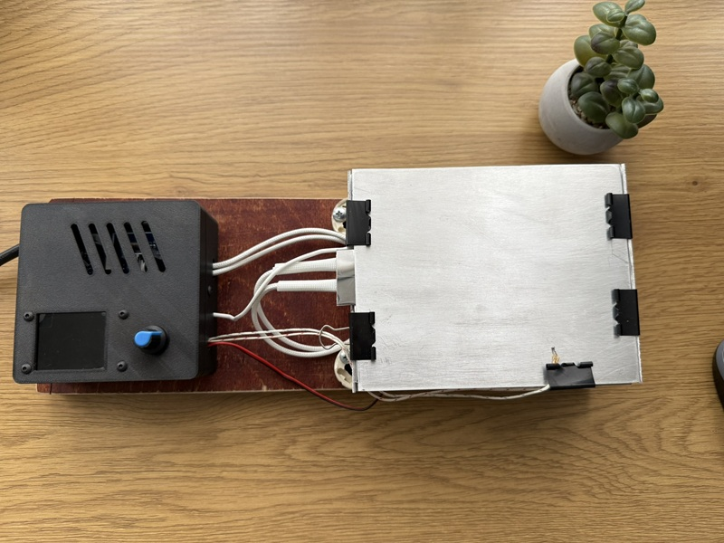
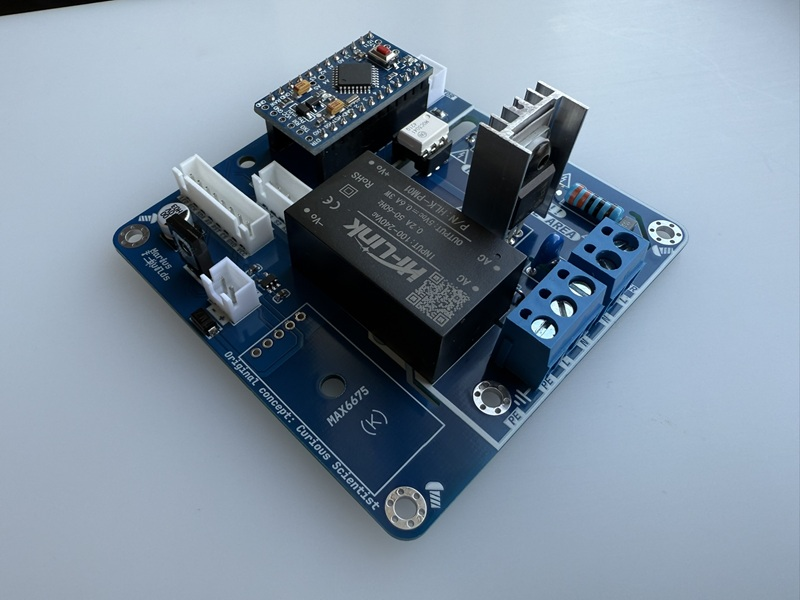
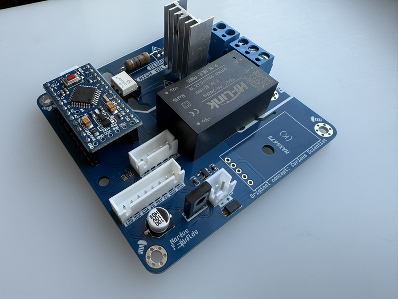
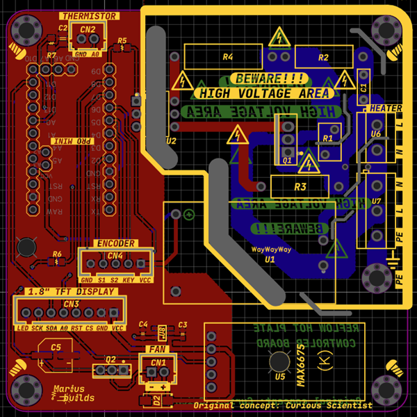
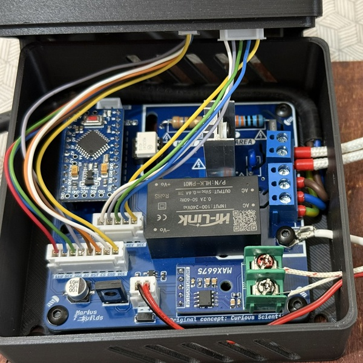
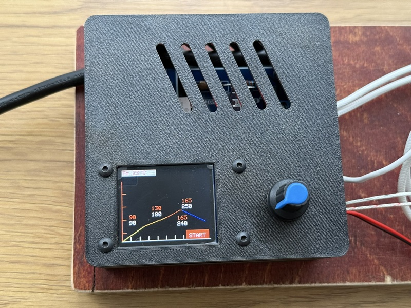

# Reflow Hot Plate Controller

An **80×80mm** reflow hot plate controller board built around an **Arduino Pro Mini**. Put a PCB on the plate, pick a profile, and watch the solder paste turn into shiny joints. 

It's like a toaster oven, but for people who own more tweezers than forks.

This is a remix of the **[Reflow hot plate controller board](https://www.pcbway.com/project/shareproject/Reflow_hot_plate_controller_board_a603f769.html)** by **[Curious Scientist](https://www.youtube.com/@CuriousScientist)**. All the clever engineering and the firmware are his. I just made the board smaller, added a thermistor input and a case.

---

## ⚡⚡ DANGER: HIGH VOLTAGE ⚡⚡

**This board works directly with MAINS VOLTAGE (230V / 120V AC).** The big yellow outline on the PCB that says **"BEWARE!!! HIGH VOLTAGE AREA"** is not decoration, and it's not there for the aesthetics. It's there because touching it while plugged in can **seriously injure or kill you**.

- **Never touch the board, the heater terminals or the heatsink while it's plugged in.** Not even "just for a second to check something".
- **Always unplug it before working on it.** Unplugged from the wall, not just "switched off" in the menu.
- **Never program or debug the Arduino while the board is connected to mains.** USB-serial adapters and your laptop are not isolated from the mains side if something fails. Program first, plug into the wall later.
- **Put it in a closed, non-conductive case** before using it. The 3D-printable case exists for a reason.
- **Connect the earth (PE) wire** to the metal body of the heating plate.
- **Add a fuse** on the mains input (inline fuse holder or a fused IEC socket). The board itself doesn't have one.
- **Double-check all the mains wiring** before plugging in, then check it again. Screw terminals must be tight, no stray strands of wire.
- **The heating plate gets hot enough to melt solder** (that's the whole point), so keep it away from anything flammable and never leave it running unattended.

If you're not comfortable working with mains voltage, ask someone experienced to help, or skip this project. There's no shame in it, and no "undo" button for electrocution.

---

## MAIN FEATURES :

- **Compact 80×80mm PCB** – smaller than the original, same job.
- **Arduino Pro Mini** as the brain – plugs straight into the board.
- **Onboard HLK-PM01** – powers the electronics straight from mains, no external power supply needed.
- **BTA08-600B triac + MOC3041 zero-cross optocoupler** – switches the heater safely and keeps the low-voltage side isolated from the mains side.
- **Varistor + snubber** on the mains side, for protection against spikes.
- **MAX6675 K-type thermocouple module** for accurate plate temperature readings.
- **Extra thermistor input (A0)** – new in this version, for a second temperature reading.
- **1.8" ST7735 TFT display + rotary encoder** – pick profiles and watch the temperature curve live.
- **5V fan output** (BD139 driver) – for cooling the plate down faster after the reflow.
- **Clearly marked HIGH VOLTAGE AREA** on the PCB, with generous isolation from the low-voltage side.

  
  

## Connectors 

| Connector | Pins | Function |
|---|---|---|
| **Mains input** (U7) | PE / N / L | 230V / 120V AC input – ⚡ HIGH VOLTAGE |
| **HEATER** (U6) | N / L | To the PTC heating plate – ⚡ HIGH VOLTAGE |
| **1.8" TFT DISPLAY** (CN3) | LED, SCK, SDA, A0, RST, CS, GND, VCC | ST7735 display |
| **ENCODER** (CN4) | GND, S1, S2, KEY, VCC | Rotary encoder |
| **THERMISTOR** (CN2) | GND, A0 | Optional thermistor |
| **FAN** (CN1) | + / − | Optional 5V cooling fan |

Everything inside the yellow outline is the mains side. Everything outside it is the friendly 5V side. Keep it that way.

## Extra parts you'll need 🛒

These are **not** included in the BOM:

- **Arduino Pro Mini** (5V / 16MHz)
- **MAX6675 K-type thermocouple module**: [AliExpress](https://www.aliexpress.com/w/wholesale-max6675-k-type.html), or build my own [MAX6675 module](https://www.pcbway.com/project/shareproject/MAX6675_Module_7ce874db.html)
- **1.8" ST7735 TFT display**: [AliExpress](https://www.aliexpress.com/item/32974789010.html)
- **Rotary encoder module**: [AliExpress](https://www.aliexpress.com/item/1005006986329518.html)
- **PTC heating plate** (150×120mm): [AliExpress](https://www.aliexpress.com/w/wholesale-PTC-Heating-Plate.html). Choose one rated for your mains voltage (220V/230V or 110V/120V)!
- **TO-220 aluminum heatsink** for the BTA08 triac: [AliExpress](https://www.aliexpress.com/w/wholesale-to-220-heat-sink.html). The triac gets warm switching the heater, and a warm triac is a happy triac; a hot one is a short-lived one.
- **60mm 5V fan**: [AliExpress]([https://www.aliexpress.com/item/1005004231382197.html](https://www.aliexpress.com/w/wholesale-60mm-fan-5v.html)

## Firmware 

The firmware is **Curious Scientist's work** and is available **exclusively to his YouTube channel members**. Please **don't ask me for the code**. Support the person who wrote it by joining his channel: https://www.youtube.com/@CuriousScientist

He also explains the sketch line by line in this video: https://youtu.be/9xac7aseDws?t=1027

**Remember:** upload the firmware with the board **disconnected from mains**!

## Main components 

| Part | Component | LCSC |
|---|---|---|
| AC-DC power module | HLK-PM01 | C209903 |
| Triac | BTA08-600BRG | C154536 |
| Zero-cross optotriac | MOC3041M | C8921 |
| Varistor | TDK B72205S0251K101 | C125479 |
| Fan transistor | BD139-10 | C2970334 |
| LDO 3.3V | AP2112K-3.3TRG1 | C51118 |
| Mains terminal | KF301-5.0-3P | C474882 |
| Heater terminal | KF301-5.0-2P | C474881 |

Full BOM in the **GERBER, BOM, PNP** folder.

## Case 

The 3D-printable case is in the **STL FILES and F3Z** folder, and also on Printables: https://www.printables.com/model/1217156-reflow-hot-plate-controller-board-case

Use it. A board with exposed mains is not a "minimalist design", it's a hazard.

  
  

Inside the case: crimp ferrules on every mains wire, earth connected, and the MAX6675 module sitting right on the board. On the outside: the reflow profile on the display and a single knob to rule them all.

## Credits

Original concept, design and firmware by **[Curious Scientist](https://www.youtube.com/@CuriousScientist)**. Go subscribe, his channel is full of great electronics projects.

## License

The PCB design is licensed under [Creative Commons Attribution-ShareAlike 4.0 International](https://creativecommons.org/licenses/by-sa/4.0/). The firmware is **not** included and remains the property of Curious Scientist.

- ✅ **Share** – copy and redistribute it in any medium or format
- ✅ **Adapt** – remix, transform, and build upon it
- 🏷️ **Attribution** – give credit to Curious Scientist and to this remix
- 🔁 **ShareAlike** – if you remix it, share your version under the same license

**Disclaimer:** this project involves mains voltage and high temperatures. You build and use it entirely at your own risk.

## Donate ☕

If you'd like to say thanks or buy me a coffee, a **[PayPal donation](https://www.paypal.com/donate/?hosted_button_id=KHR7DYJP2Z8QJ)** is always appreciated!

Have fun, solder safely, and enjoy it ! 😊
